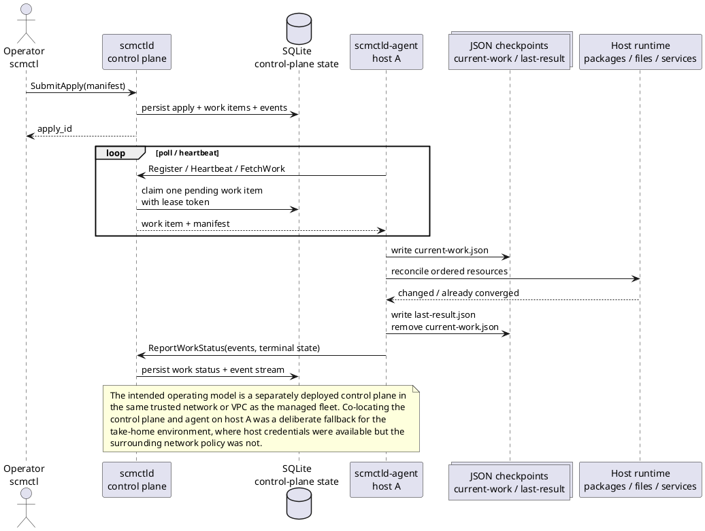

# scm

`scm` is a small host configuration management MVP written in Go. It has three binaries:

- `scmctl`: validates and submits manifests
- `scmctld`: control plane daemon
- `scmctld-agent`: per-host reconciliation agent

The project is intentionally shaped like a real service rather than a one-off script: clear domain boundaries, gRPC between components, durable control-plane state, a bounded host-local checkpoint model, a read-only operational UI, Prometheus metrics, and Ubuntu packaging/systemd assets.

## What I Built

The MVP supports:

- host targeting by explicit host ID and exact-match label selectors
- declarative `package`, `file`, and `service` resources
- dependency ordering via `requires`
- change-triggered follow-up behavior via `notifies`
- idempotent reconciliation on the host
- agent-pull work distribution with lease-based claiming
- a small control-plane UI for inventory, apply status, and event history

For the take-home, I successfully demonstrated the full path on host A:

1. `scmctl` submitted a manifest
2. `scmctld` created and assigned work
3. `scmctld-agent` reconciled the host
4. the host served `Hello, world!` over HTTP

## Architecture

### Operating model

- `scmctl` is the operator-facing submit and validation tool
- `scmctld` is the control plane and system of record
- `scmctld-agent` runs 1:1 on managed hosts and performs reconciliation locally
- SQLite is used for control-plane MVP persistence
- the agent keeps only a bounded JSON checkpoint on disk for crash recovery; the control plane remains the canonical history and journald is the host-local execution log

This is an agent-pull design. The control plane does not SSH into hosts or use stored passwords to perform changes.

### Intended topology

The intended steady-state deployment model is:

- `scmctld` deployed separately from managed hosts
- `scmctld-agent` deployed 1:1 on managed hosts
- all components living on the same trusted company network or VPC

For the constrained demo, I co-located `scmctld` and `scmctld-agent` on host A. That was a practical fallback because I only had host credentials, not control over the surrounding AWS network policy.

Host B should be able to call host A's `scmctld` over `8443/tcp` in a normal environment. The observed host B failure was environmental network policy, not a flaw in the control model.

### Diagram



### Key implementation choices

- `internal/manifest`: DSL parsing, validation, graph construction, compile step
- `internal/controlplane`: inventory, apply lifecycle, and work queue concerns
- `internal/agent`: registration, polling, reconciliation, and host execution
- `internal/platform`: shared config, logging, metrics, gRPC, clock, version helpers

Work dispatch is lease-based:

1. agent registers and heartbeats
2. idle agent calls `FetchWork`
3. control plane claims one pending item transactionally in SQLite
4. agent reconciles locally
5. agent reports events and terminal state back to the control plane

## Manifest DSL

Manifests are YAML and can target hosts explicitly or by selector.

```yaml
apiVersion: scm/v1
kind: Manifest
metadata:
  name: php-app-host-a
target:
  hosts:
    - php-web-1
resources:
  - id: nginx_pkg
    type: package
    name: nginx
    state: installed
  - id: app_index
    type: file
    path: /var/www/scm-php-demo/index.php
    content: |
      <?php
      header("Content-Type: text/plain");
      echo "Hello, world!\n";
      ?>
    mode: "0644"
    owner: www-data
    group: www-data
    state: present
    notifies:
      - php_fpm_svc
  - id: nginx_svc
    type: service
    name: nginx
    state: running
    enabled: true
```

Supported resource types:

- `package`
  - `name`
  - `state: installed|absent`
- `file`
  - `path`, `content`, `mode`
  - optional `owner`, `group`
  - `state: present|absent`
- `service`
  - `name`
  - `state: running|stopped`
  - optional `enabled`

Relationship behavior:

- `requires` defines DAG ordering and is topologically sorted before execution
- `notifies` revisits downstream service resources if an upstream resource changed

Validation guarantees:

- resource IDs are unique
- `requires` and `notifies` references must exist
- `notifies` can only target service resources
- dependency cycles are rejected

Canonical examples:

- [examples/manifests/nginx.yaml](/Users/alexisjcarr/learning/scm/examples/manifests/nginx.yaml)
- [examples/manifests/php-app-host-a.yaml](/Users/alexisjcarr/learning/scm/examples/manifests/php-app-host-a.yaml)
- [examples/manifests/php-app-two-hosts.yaml](/Users/alexisjcarr/learning/scm/examples/manifests/php-app-two-hosts.yaml)

## Quickest Demo Path

### Local dev loop

```bash
make test
go run ./cmd/scmctld -config ./configs/examples/scmctld.yaml
go run ./cmd/scmctld-agent -config ./configs/examples/scmctld-agent.yaml
go run ./cmd/scmctl validate -f ./examples/manifests/nginx.yaml
go run ./cmd/scmctl apply -f ./examples/manifests/nginx.yaml --server 127.0.0.1:8443
```

Use `http://127.0.0.1:8080` and the apply detail page as the source of truth during local testing.

### Take-home host A fallback

The fastest successful evaluator path is the host A fallback:

- run `scmctld` and `scmctld-agent` on host A
- point the agent at `127.0.0.1:8443`
- use the single-host PHP manifest

Required host A config values:

`/etc/scm/scmctld.yaml`

```yaml
grpc_listen_address: ":8443"
http_listen_address: ":8080"
database_path: "/var/lib/scm/scmctld.db"
log_level: "info"
log_json: false
lease_duration: 2m
```

`/etc/scm/scmctld-agent.yaml`

```yaml
control_plane_address: "127.0.0.1:8443"
state_dir: "/var/lib/scm/scmctld-agent/state"
manifest_cache_dir: "/var/lib/scm/scmctld-agent/manifests"
metrics_listen_address: ":9108"
host_id: "php-web-1"
agent_id: "php-web-1-agent"
labels:
  role: "web"
  env: "takehome"
log_level: "info"
log_json: false
poll_interval: 5s
run_timeout: 5m
```

The installed helper path is:

```bash
sudo ./smoke.sh
scm-host-a-demo
```

What those helpers do:

- install and start the packaged daemons
- point you at the expected config values
- validate local health checks
- submit the single-host PHP manifest
- print the apply detail URL and verification commands

Trusted progress view:

- control plane apply detail page: `http://127.0.0.1:8080/applies/<apply_id>`
- agent execution logs: `journalctl -u scmctld-agent -f -o cat`

I do **not** recommend `scmctl --watch` as the primary demo view right now.

### Verification

Local verification:

```bash
curl -sv http://127.0.0.1/
systemctl status scmctld --no-pager
systemctl status scmctld-agent --no-pager
```

If public ingress is available:

```bash
curl -sv http://PUBLIC_IP/
```

Expected result:

- `200 OK`
- response body includes `Hello, world!`

## Packaging / Install

Build release artifacts:

```bash
./scripts/release.sh dev
```

On Ubuntu:

```bash
tar -xzf scm_dev_linux_amd64.tar.gz
cd scm
sudo ./smoke.sh
```

The release bundle includes:

- all three binaries
- example configs
- systemd units
- example manifests
- `install.sh`
- `smoke.sh`
- `scm-host-a-demo`

Steady-state daemons run as dedicated service users:

- `scmctld`
- `scmctld-agent`

The agent uses a narrow sudoers policy for package, service, and privileged file operations instead of running the entire daemon as root.

## Tradeoffs and Known Limitations

### What I prioritized

- clean control-plane / agent separation
- explicit domain boundaries
- idempotent host reconciliation
- operational visibility via UI, logs, and metrics
- Ubuntu-friendly packaging and systemd integration

### Known limitations

- `scmctl --watch` is currently noisy and can duplicate early event output; the apply-detail page is the source of truth
- host B demonstration was blocked by environment/network controls I did not have access to change
- bootstrap and debugging still involve more manual root work than I would want long term
- SQLite is appropriate for the control plane MVP but not the final production persistence story
- the agent-local checkpoint model is intentionally minimal; with more time I would add explicit retention/cleanup and restart-resume semantics around it

### With more time

- separate poll cadence and run timeout is now fixed, but I would further harden the agent execution and progress-reporting path
- improve installer and bootstrap ergonomics so the demo path requires less manual host editing
- fix the `scmctl --watch` stream behavior
- add a cleaner production deployment story for a separately hosted control plane in a shared VPC/network
- broaden validation and end-to-end testing around real distro/package differences
