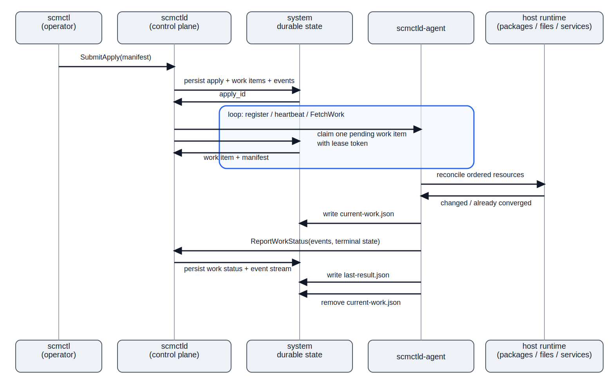

# Simple Config Manager (scm)

`scm` is a host configuration management system written in Go. I intentionally designed it as a distributed service rather than a one-off script.

## What I Built

The system supports:

- host targeting by explicit host ID and exact-match label selectors
- declarative `package`, `file`, and `service` resources
- explicit, deterministic dependency ordering via `requires`
- change-triggered follow-up behavior via `notifies`
- idempotent reconciliation on the host
- agent-pull work distribution with lease-based claiming
- a small control-plane UI for inventory, rollout status, and event history
- agent diagnostics endpoints and Prometheus metrics

For this project, I validated the end-to-end workflow on two separate Ubuntu hosts:

1. accept desired state from an operator-facing CLI
2. resolve that desired state into executable per-host work
3. drive host reconciliation toward the requested state
4. verify the resulting service was reachable over HTTP

## Architecture

### Operating model

- `scmctl` is the operator-facing submit and validation tool
- `scmctld` is the control plane and system of record
- `scmctld-agent` runs 1:1 on managed hosts and performs reconciliation locally
- the control plane remains the canonical history and audit store
- the agent keeps only a bounded JSON checkpoint for crash recovery
- `journald` provides the host-local execution log

This is an agent-pull design. The control plane does not SSH into hosts or store host credentials to perform changes directly. The agent keeps only a bounded JSON checkpoint on disk for crash recovery, which keeps the host-side persistence model simple while leaving the control plane as the canonical audit/history store.

### Intended topology



The intended steady-state deployment model is:

- `scmctld` deployed separately from managed hosts
- durable shared state for inventory, desired changes, work assignment, and execution history
- `scmctld-agent` deployed 1:1 on managed hosts
- all components living on the same trusted company network or VPC

I intentionally designed this as a control plane plus pull-based agents rather than a per-host shell script. The goal was to build something that still makes sense beyond the first one or two machines, with a central system of record, durable change history, and per-host reconciliation.

I was constrained by the project environment because I only had host-level access to two Linux hosts. I did not have control over network security groups, and I did not have a reliable view of the surrounding VPC configuration or network topology. I initially tried to deploy `scmctld` and `scmctld-agent` on one host and only `scmctld-agent` on the other, but I could not establish the required connectivity from the remote agent back to `scmctld`.

Because of that constraint, I validated the intended multi-process shape locally with Docker Compose, and I validated the full control-plane-plus-agent path on the provided infrastructure by deploying the full system independently on each host. That was a demo fallback, not the intended production architecture.

## Major Design Choices

### Code structure and boundaries

I structured the codebase to keep domain logic separate from transport and runtime concerns:

- `internal/manifest`: DSL parsing, validation, dependency-graph construction, and manifest compilation
- `internal/controlplane`: inventory, apply lifecycle, and work queue concerns
- `internal/agent`: registration, polling, reconciliation, and host execution
- `internal/platform`: shared config, logging, metrics, gRPC, clock, and version helpers

That separation keeps the core behavior easier to change and test without coupling everything to gRPC handlers, persistence details, or host-specific execution code.

### Agent-pull instead of SSH/push

I chose an agent-pull model because the control plane should coordinate desired state, not reach into hosts to execute changes. A per-host agent that pulls work is a cleaner and more scalable operating model than central SSH-based orchestration.

Work dispatch is agent-pulled and lease-backed. Agents register, heartbeat, and poll for work when idle. The control plane atomically assigns a pending work item with a lease token, and the agent reconciles local state and reports progress back.

### SQLite only in the control plane

The control plane needs durable state for registered agents, requested changes, assigned work, and execution history. SQLite was a good tradeoff for this project: durable, simple, and sufficient for the control-plane UI and recoverable work queue without adding more infrastructure.

The control plane data model is also a natural fit for a relational store: inventory, desired changes, work assignment, and execution history are related records, and work claiming needs safe, atomic state transitions.

At larger scale, I would move the control plane onto a separate RDBMS rather than keeping SQLite embedded in-process. With control-plane persistence externalized, `scmctld` becomes straightforward to scale horizontally because inventory, desired changes, work assignment, and execution history are centralized rather than tied to a single process.

### Explicit dependency graph in the DSL

The manifest DSL supports `requires` and `notifies` so the executor can model ordering and change-triggered follow-up behavior intentionally. `requires` becomes a DAG and is topologically sorted before reconciliation, which gives predictable and explainable execution order instead of relying on file order.

That is more machinery than this project strictly required, but I included it because production configuration management needs explicit ordering semantics. I wanted reconciliation order to be intentional and explainable rather than an accident of manifest layout.

## Manifest DSL

Manifests are YAML and can target hosts explicitly or by selector.

```yaml
apiVersion: scm/v1
kind: Manifest
metadata:
  name: php-app-single-host
target:
  hosts:
    - demo-host-1
resources:
  - id: nginx_pkg
    type: package
    name: nginx
    state: installed
  - id: app_index
    type: file
    path: /var/www/scm-php-demo/index.php
    content: |
      <?php
      header("Content-Type: text/plain");
      echo "Hello, world!\n";
      ?>
    mode: "0644"
    owner: www-data
    group: www-data
    state: present
    notifies:
      - php_fpm_svc
  - id: nginx_svc
    type: service
    name: nginx
    state: running
    enabled: true
```

Supported resource types:

- `package`
  - `name`
  - `state: installed|absent`
- `file`
  - `path`, `content`, `mode`
  - optional `owner`, `group`
  - `state: present|absent`
- `service`
  - `name`
  - `state: running|stopped`
  - optional `enabled`

Relationship behavior:

- `requires` defines explicit DAG ordering and is topologically sorted before execution
- `notifies` revisits downstream service resources if an upstream resource changed

Validation guarantees:

- resource IDs are unique
- `requires` and `notifies` references must exist
- `notifies` can only target service resources
- dependency cycles are rejected

Example manifests:

- [examples/manifests/nginx.yaml](examples/manifests/nginx.yaml)
- [examples/manifests/php-app-single-host.yaml](examples/manifests/php-app-single-host.yaml)
- [examples/manifests/php-app-two-hosts.yaml](examples/manifests/php-app-two-hosts.yaml)

## Run and Test

### Quick project path

If you only want the fastest path to a working demo, use the packaged Ubuntu flow in [Installation](#installation) and then run `scm-demo`.

If you want to inspect the code locally first:

1. run the unit tests with `make test`
2. start `scmctld` and `scmctld-agent` with the example configs
3. submit one of the example manifests with `scmctl`
4. use the control-plane UI at `http://127.0.0.1:8080` to inspect inventory and apply state

### Local dev loop

Build and test:

```bash
make build
make test
```

Start the control plane and agent with example configs:

```bash
go run ./cmd/scmctld -config ./configs/examples/scmctld.yaml
go run ./cmd/scmctld-agent -config ./configs/examples/scmctld-agent.yaml
```

Validate and submit a manifest:

```bash
go run ./cmd/scmctl validate -f ./examples/manifests/nginx.yaml
go run ./cmd/scmctl apply -f ./examples/manifests/nginx.yaml --server 127.0.0.1:8443
```

Use `http://127.0.0.1:8080`, the apply detail page, or `scmctl --watch` during local testing. The example configs are biased toward the packaged Ubuntu path under `/var/lib/scm/...`; for repo-local experimentation you can either override the paths or use the Compose/dev config under `configs/dev`.

### Packaged Ubuntu demo

Build a release bundle:

```bash
./scripts/release.sh dev
```

On Ubuntu:

```bash
tar -xzf scm_dev_linux_amd64.tar.gz
cd scm
sudo ./smoke.sh
```

The quickest successful evaluator path is the standalone packaged demo:

- run `scmctld` and `scmctld-agent` on the same host
- point the agent at `127.0.0.1:8443`
- use the single-host PHP manifest

Required config values:

`/etc/scm/scmctld.yaml`

```yaml
grpc_listen_address: ":8443"
http_listen_address: ":8080"
database_path: "/var/lib/scm/scmctld.db"
agent_auth_tokens:
  demo-host-1-agent: "demo-host-1-token"
log_level: "info"
log_json: false
lease_duration: 2m
```

`/etc/scm/scmctld-agent.yaml`

```yaml
control_plane_address: "127.0.0.1:8443"
state_dir: "/var/lib/scm/scmctld-agent/state"
manifest_cache_dir: "/var/lib/scm/scmctld-agent/manifests"
metrics_listen_address: ":9108"
host_id: "demo-host-1"
agent_id: "demo-host-1-agent"
auth_token: "demo-host-1-token"
labels:
  role: "web"
  env: "demo"
log_level: "info"
log_json: false
poll_interval: 5s
run_timeout: 5m
```

The installed helper path is:

```bash
sudo ./smoke.sh
scm-demo
```

I used this same standalone deployment pattern on two separate hosts. Each host ran its own control plane and agent locally, and each successfully converged the PHP app to `Hello, world!`.

Progress view options:

- control plane apply detail page: `http://127.0.0.1:8080/applies/<apply_id>`
- `scmctl --watch`
- agent execution logs: `journalctl -u scmctld-agent -f -o cat`

### Verification

Local verification:

```bash
curl -sv http://127.0.0.1/
systemctl status scmctld --no-pager
systemctl status scmctld-agent --no-pager
```

If public ingress is available:

```bash
curl -sv http://PUBLIC_IP/
```

Expected result:

- `200 OK`
- response body includes `Hello, world!`

### CI and automated checks

- `make test` -> `./scripts/test.sh`
- GitHub Actions CI at [.github/workflows/test.yml](.github/workflows/test.yml)
- GitHub Actions packaged artifacts at [.github/workflows/artifacts.yml](.github/workflows/artifacts.yml)
- steady-state daemons run as dedicated service users, with a narrow sudoers policy for package, service, and privileged file operations

## Installation

### Local prerequisites

For local development:

- Go 1.23+
- `make`
- a Unix-like environment with standard shell tools

For the packaged host demo:

- Ubuntu
- `systemd`
- `sudo`
- `apt` / `dpkg`

I did not optimize the primary demo path around Docker because package installation, service management, sudo policy, and host-local reconciliation are central to the problem.

## Third-Party Tools and Libraries

Primary third-party dependencies:

- `google.golang.org/grpc`: gRPC transport between `scmctl`, `scmctld`, and `scmctld-agent`
- `gopkg.in/yaml.v3`: manifest and config parsing
- `github.com/prometheus/client_golang`: metrics instrumentation and Prometheus exposition
- `modernc.org/sqlite`: embedded SQLite driver for the control-plane persistence layer

System tools the agent intentionally relies on:

- `apt-get` / `dpkg` for package reconciliation
- `systemctl` for service reconciliation
- `sudo` for narrowly scoped privileged operations
- `journald` for host-local execution logs

Development tooling:

- OpenAI Codex: used to accelerate implementation and iteration; the system design, architecture, and tradeoff decisions are my own

I did not use third-party hosted APIs. The system is self-contained aside from the OS package and service manager on Ubuntu hosts.
